# JSX / TSX is that a good thing?

Demos from the blog post "JSX is that a good thing", Spanish version available on this [link](http://www.formacion.lemoncode.net/lemoncode-blog/2016/3/31/jsx-tsx-que-tiene-de-bueno), English version read below.

## To get started:

In samples [01 HTML inside JS](./01 HTML inside JS) and [02 HTML inside JS backticks](./02 HTML inside JS backticks) open index.html in browser.

To the rest samples:

1. Install [Node.js](http://www.nodejs.org)
2. Download/clone this repo
3. Open the command line of your choice and locate yourself in the root directory of this repo on your machine
4. `npm install` - Installs packages
5. `npm start` - Builds the project and launch a lite web server (webpack-dev-server).
6. Navigate to [http://localhost:8080/](http://localhost:8080/) if your browser doesn't open automatically.

## JSX / TSX is that a good thing?

One of the matters that wonder us when we have first look at React is that ‘HTML’ is embedded in JavaScript files. Due to this many of developers have rejected it, assuming that involves going back to ‘Spaghetti code’, breaking principles as ‘Separation of concerns’.

On my own, I couldn’t understand how the good practices were breaking so flagrant, meanwhile really big IT enterprise such as Facebook, Airbnb, Uber, Yahoo, Pinterest, … embraced it as standard. Is there a piece of puzzle that we’re missing? Let’s dig a bit to figure out what is this about.

### EXAMPLES

Nowadays, when we were adding HTML to our JavaScript code, we insert a _string_:

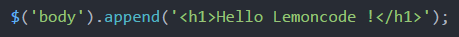

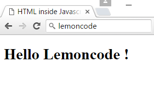

If we were more ES56 aligned, we would do it using backticks or HTML templates:

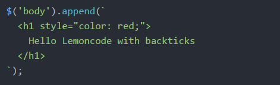

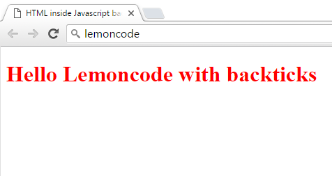

With this approach we have a trouble… we trust that this string will be used to mount an HTML well defined (free of errors).

What happens when we do the same with JSX or TSX (TypeScript _(*)_ version of JSX)? This looks this way:

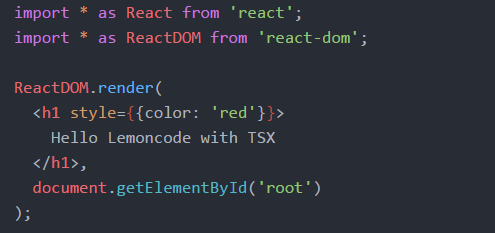

_(*) TypeScript is an open source language created by Microsoft, JavaScript compatible, that adds features such as types, a good link to learn more about this language:_ [http://www.typescriptlang.org/docs/tutorial.html](http://www.typescriptlang.org/docs/tutorial.html)

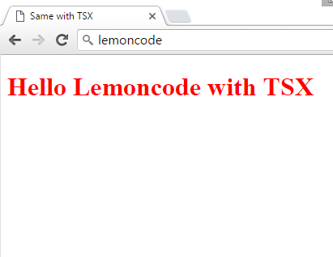

It looks like HTML, indeed? No… If we watch the generated JavaScript, we can surprise ourselves, when we realize that the HTML, becomes code:

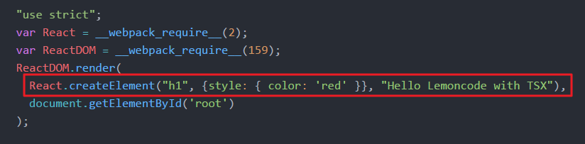

What is the advantage on this? **Productivity**. Let’s look how:

We're going to create a JSX file and we're forgetting to close a DIV.

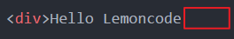

We can see on our favorite text editor or IDE (Atom, Visual Studio Code), when we transpile, that the error is marked in red. We don’t need to launch our web page in the browser to see this! Why? Because it's not really HTML, it's a JavaScript XML syntax transform and it’s not possible to generate “createElement” sequence, so we get an error message:

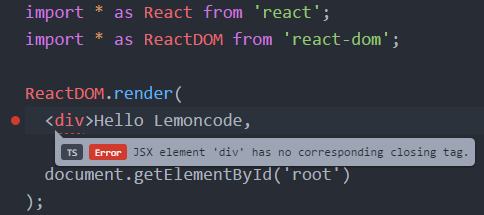

Let’s move to another example… What if I’m wrong typing a tag? I get notified too.

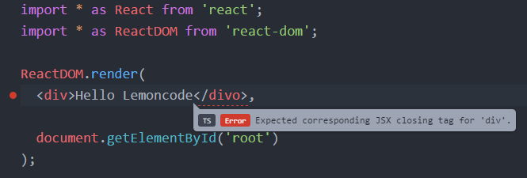

For the next example we are going to create a React component, we will call it _Company_, and will have a property type _string_ called _Name_.

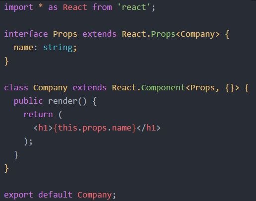

When we use the component, if we try to use a property that is not defined, we get noticed:

Error message:

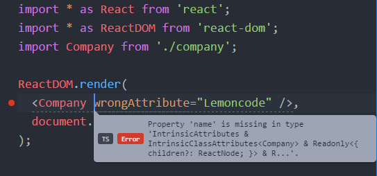

Let’s introduce a mistake writing a _binding_, instead of ‘name’ let’s write ‘names’ _Voilà_, we also get noticed about the error! (If you come from Angular, it’s pretty sure that this will gladly surprise you, how many times have we gone crazy reviewing code when we have just a typo on a _binding_).

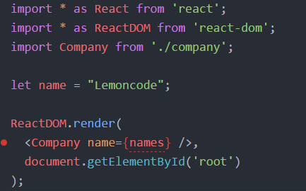

Now let’s take advantage of using TypeScript, _what if we have a string property and we feed it with a number?_ (we are still working on the previous component Company example).

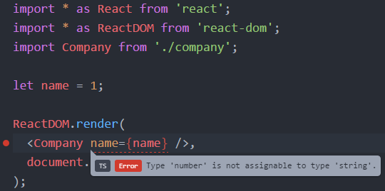

And just the last trick… Imagine that we have a table defined this way:

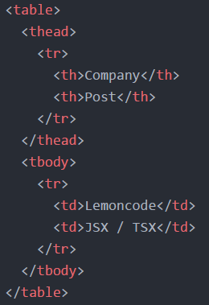

Have you ever forgotten a `<tr>` on header? For instance:

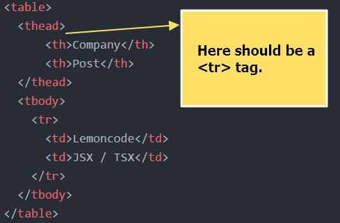

What if we have this in a JSX file and we execute it? If you look on the browser’s console, you will find a _warning_:

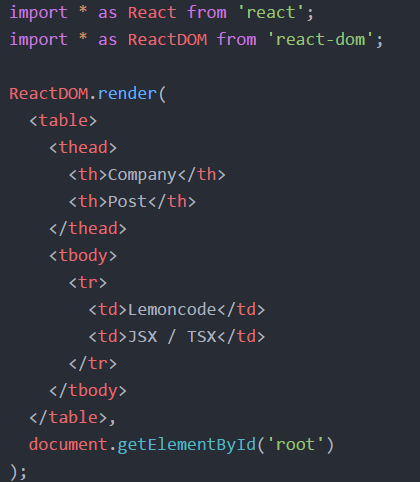

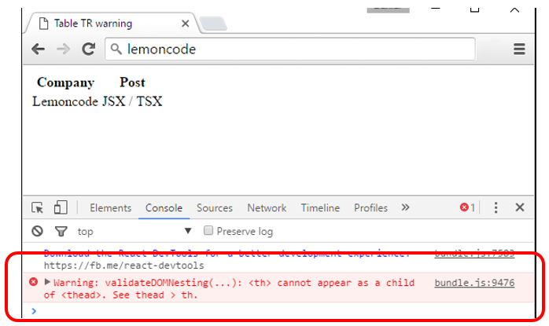

### CONCLUSION
As we have seen on the examples, all these improvements free us of a lot of silly errors and let us focus on development. How many times we have been even tempted to check our RAM chips or blame framework XYZ of a bug, when suddenly we have figured out that all it was a dummy typo on our HTML?

In the other hand, about ‘Separation of Concerns’:

+ In the HTML we use to enrich it with directives / code, for example use ng-repeat on Angular. In React we turn the concept the other way around: In JSX/TSX we define the HTML with JavaScript

+ In a JSX/TSX file, we only define the view, it is our task to create our architecture (business objects, actions, reducers, …)

The example code of these demos is available on this repository.
